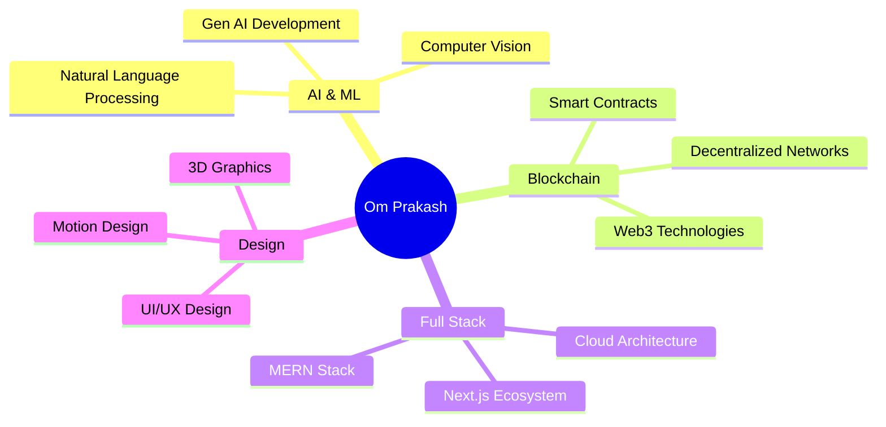

<div align="center">

<!-- 3D Animated Header -->


</div>

<!-- Animated Typing SVG -->
<p align="center">
  
</p>

<!-- Animated Divider -->


<!-- About Me Section with 3D Cards Effect -->
<div align="center">

## 🚀 About Me

<table>
<tr>
<td width="50%">

```typescript
const omPrakash = {
    role: "Full Stack Developer",
    experience: "3+ Years",
    location: "Bihar, India 🇮🇳",
    passion: [
        "🤖 AI & Machine Learning",
        "⛓️ Blockchain Technology",
        "🎨 UI/UX Design",
        "🚀 Building Scalable Solutions"
    ],
    currentlyWorking: "PepsiCo - Frontend Developer",
    currentlyLearning: "Advanced Gen AI & Web3",
    funFact: "I turn coffee ☕ into code 💻"
};
```

</td>
<td width="50%">

### 💼 Professional Highlights

- 🏆 **Led PepsiConnect** to 1M+ users
- 📈 **Boosted retention** by 45% at DRIP
- 🔐 **Built secure email** platform (e-Patra)
- 🎯 **35+ projects** delivered successfully
- 🌟 **Recognized** in Global Townhall Q4

</td>
</tr>
</table>

</div>

<!-- Animated Divider -->


<!-- Tech Stack Section -->
<div align="center">

## 🛠️ Tech Arsenal

### 💻 Languages & Frameworks


### ⚛️ Frontend Development


### 🔧 Backend & Database


### ☁️ Cloud & DevOps


### 🤖 AI & Emerging Tech


### 🎨 Design & Tools


### 🔗 Tools & Platforms


</div>

<!-- Animated Divider -->


<!-- GitHub Stats Section -->
<div align="center">

## 📊 GitHub Analytics

<p align="center">
  
  
</p>

<p align="center">
  
  
</p>

<!-- Contribution Graph -->


<!-- Snake Animation -->
<picture>
  <source media="(prefers-color-scheme: dark)" srcset="https://raw.githubusercontent.com/SamNickGammer/SamNickGammer/output/github-contribution-grid-snake-dark.svg">
  <source media="(prefers-color-scheme: light)" srcset="https://raw.githubusercontent.com/SamNickGammer/SamNickGammer/output/github-contribution-grid-snake.svg">
  
</picture>

</div>

<!-- Animated Divider -->


<!-- Trophies Section -->
<div align="center">

## 🏆 GitHub Trophies


</div>

<!-- Animated Divider -->


<!-- Featured Projects -->
<div align="center">

## 🚀 Featured Projects

<table>
<tr>
<td width="50%">

### 🤖 GitHub AI for Developers
**SaaS Platform | Ongoing**

Built with Next.js 15, Google Gemini AI & Assembly AI

- 🎯 Automated code analysis & debugging
- ⚡ 50% faster onboarding for new codebases
- 🔗 Seamless GitHub integration

[](https://github.com/SamNickGammer)

</td>
<td width="50%">

### 📧 e-Patra: Secure Email
**Enterprise Email Platform**

React (TS) + Node.js + PGP Encryption

- 🔐 10,000+ secured users
- 📦 1TB+ file handling
- ☁️ Multi-cloud support

[](https://github.com/SamNickGammer)

</td>
</tr>
<tr>
<td width="50%">

### 🎨 JSON Visualizer
**Developer Tool**

Interactive tree-structured UI

- 📊 Enhanced JSON readability
- 🚀 20% productivity boost
- 🎯 Intuitive debugging interface

[](https://github.com/SamNickGammer)

</td>
<td width="50%">

### 😷 Real-Time Face Mask Detection
**AI/ML Project**

Python + Computer Vision

- 🎯 95% accuracy
- ⚡ Real-time detection
- 🏥 COVID-19 compliance

[](https://github.com/SamNickGammer)

</td>
</tr>
</table>

</div>

<!-- Animated Divider -->


<!-- Connect Section -->
<div align="center">

## 🌐 Let's Connect!

### 💼 Professional Networks

[](https://www.linkedin.com/in/omprakashbharati)
[](https://samnickgammer.github.io)
[](mailto:ombharatiofficial@gmail.com)

### 💻 Coding Platforms

[](https://leetcode.com/samnickgammer)
[](https://www.hackerrank.com/samnickgammer_)
[](https://www.hackerearth.com/@samnickgammer/)
[](https://www.geeksforgeeks.org/profile/samnickgammer)
[](https://www.codechef.com/users/samnickgammer)

### 🎨 Creative & Dev Communities

[](https://codepen.io/samnickgammer)
[](https://hashnode.com/@samnickgammer)
[](https://dev.to/samnickgammer)

### 📱 Social Media

[](https://github.com/SamNickGammer)
[](https://twitter.com/omprakash121uni)
[](https://instagram.com/samnickgammer_)
[](https://www.facebook.com/samnickgammer.57489)

</div>

<!-- Animated Divider -->


<!-- Achievements Section -->
<div align="center">

## 🎯 Achievements & Certifications

<table>
<tr>
<td width="50%">

### 🏅 Awards & Recognition
- 🥈 **2nd Place** - X-Coder by Amity University (2020)
- 🎓 **Campus Ambassador** - SmartKnower AUK (2020-21)
- 🌟 **Global Townhall Recognition** - PepsiCo Q4 2024
- 🚀 **1M+ Users Achievement** - PepsiConnect Platform

</td>
<td width="50%">

### 📜 Certifications
- ⚛️ **React 18** - Codedamn
- 💻 **Problem Solving** - HackerRank
- 📊 **Google Analytics** - Google
- ☁️ **Cloud Computing** - Udemy
- 🌐 **Web Development Master** - Swifsys Technologies

</td>
</tr>
</table>

</div>

<!-- Animated Divider -->


<!-- Research & Interests -->
<div align="center">

## 🔬 Research & Interests



### 🎓 Academic Research
**Decentralized Social Networks** - Social media based on blockchain & Ganache
- Exploring decentralized architectures
- Building trust-less systems
- Enhancing data privacy & ownership

</div>

<!-- Animated Divider -->


<!-- Current Status -->
<div align="center">

## 💡 Current Status

```yaml
Current Role: Frontend Developer @ PepsiCo
Location: Remote, Hyderabad, India
Focus Areas:
  - Building scalable enterprise solutions
  - Exploring Gen AI integrations
  - Contributing to open source
  - Learning Web3 & decentralized systems

Quick Facts:
  - 💼 3+ years of professional experience
  - 🌟 Led projects with 1M+ users
  - 🚀 35+ projects delivered successfully
  - 📚 Continuous learner & tech enthusiast
  - 🌍 Open to exciting opportunities
```

</div>

<!-- Animated Divider -->


<!-- Visitor Count & Random Quote -->
<div align="center">

## 📈 Profile Views & Random Dev Quote


</div>

<!-- Animated Divider -->


<!-- Support Section -->
<div align="center">

## ☕ Support My Work

If you find my work helpful, consider buying me a coffee! ☕

[](https://www.buymeacoffee.com/samnickgammer)
[](https://paypal.me/samnickgammer)

</div>

<!-- Footer Wave -->
<div align="center">


### 🌟 Thanks for visiting! Let's build something amazing together! 🚀

</div>