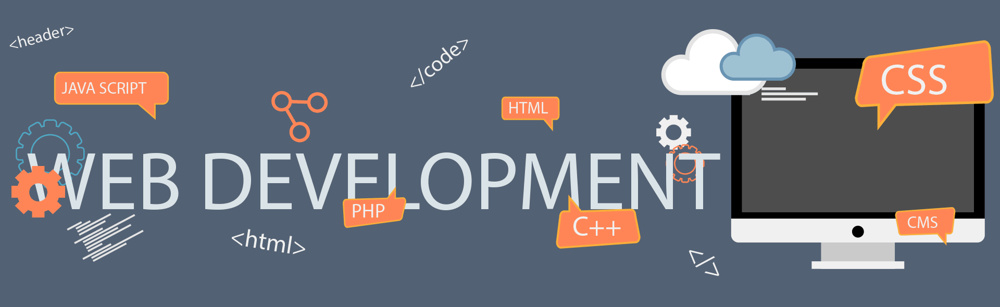

<!--### Hi there, I'm Sam - aka [SamNickGammer][website] 👋 -->
<h1 align="center">Hii  Awsome People, I'm Om Prakash Bharati</h1>
<h3 align="center">I'm an aspiring 𝗙𝘂𝗹𝗹𝗦𝘁𝗮𝗰𝗸 𝗪𝗲𝗯 𝗗𝗲𝘃𝗲𝗹𝗼𝗽𝗲𝗿 who loves Creating and Making Something Better. </h3>
  

## I'm a Student, Developer, Friend !!

- ⭐ I'm working on Personal Artificial Intelligence
- 🌱 I’m currently learning everything 🤣
- 👯 I’m looking to collaborate with other content creators
- 🥅 2021 Goals: Contribute more to Open Source projects
- ⚡ Fun fact: I love to work with Graphics and play Games

### Connect with me:

   
   
   
   
   
  

<!-- [][website]
[][facebook]
[][twitter]
[][linkedin]
[][instagram] 
 -->

### Languages and Tools:

    
    
    
    
    
    
    
    
    
    
    
    
    
    
    
    
    
    
    
    
    
    
    
    
    
    

### GitHub Trophies:

    

 

<!-- ### Most used languages:

&nbsp; 
<a href="https://github.com/ryo-ma/github-profile-trophy" target="_blank">
     
    
</a>

 -->

### GitHub Stats:

&nbsp;
<!--      -->
    
  

<!--  -->

[website]: https://samnickgammer.github.io
[course]: #
[twitter]: https://twitter.com/omprakash121uni
[facebook]: https://www.facebook.com/samnickgammer.57489
[instagram]: https://instagram.com/samnickgammer_
[linkedin]: https://linkedin.com/in/omprakashbharati
[webdevplaylist]: #
[jsplaylist]: #
[cssplaylist]: #
[reactplaylist]: #
